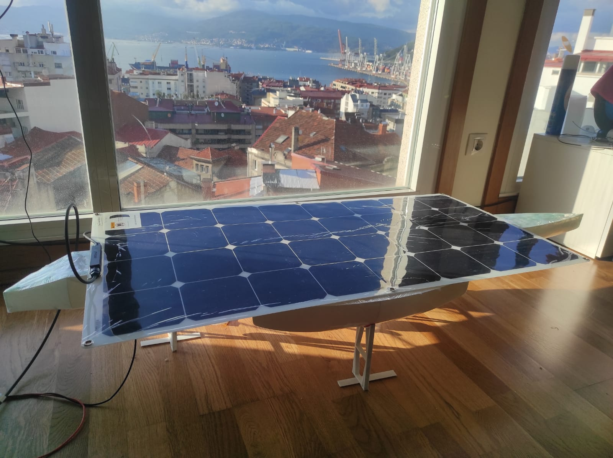
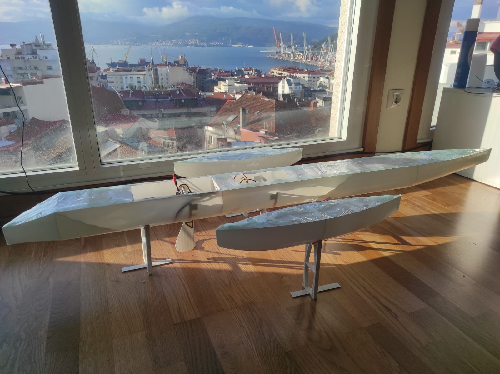
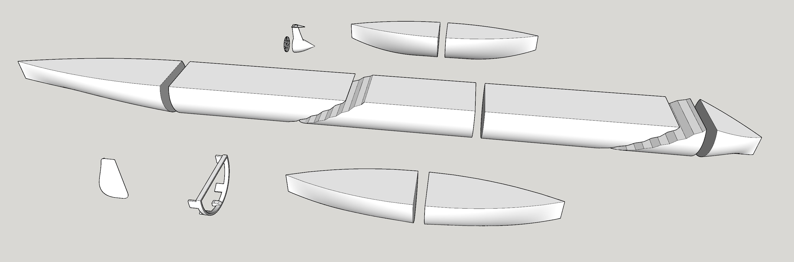
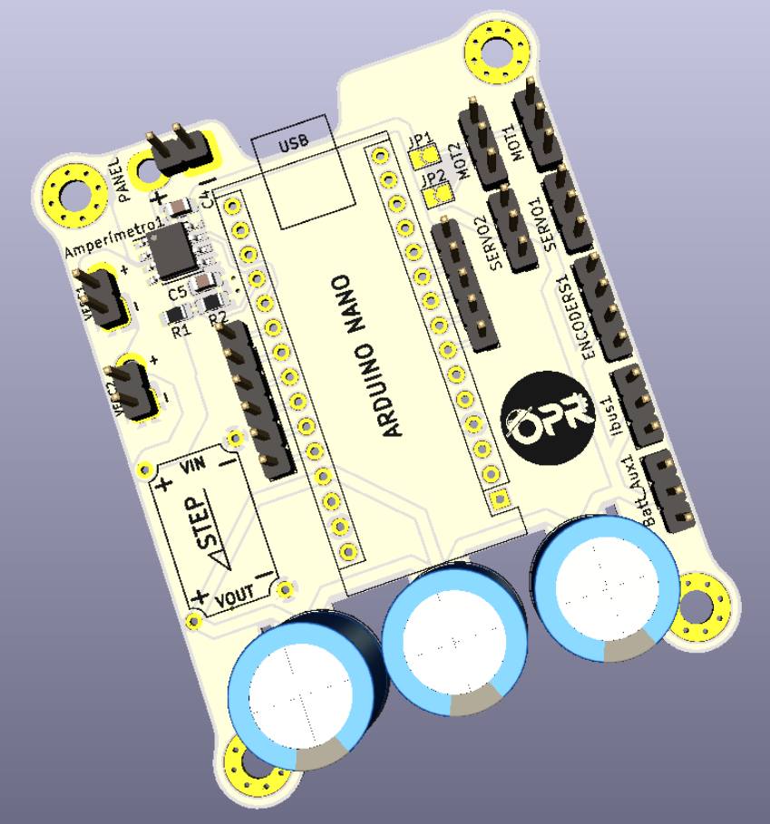

# SunnyGo
Tercer Barco solar creado por el equipo OPRobots.

El barco de este año es en esencia el mismo diseño de la ultima competición pero fabricado de cero nuevamente.
La premisa de este barco es la optimización de peso. Por ello esta completamente impreso en 3D de una sola capa de 0,4mm.

El casco esta diseñado en 6 piezas diferentes con un patron diagonal para que el ensamblado sea mas sencillo de realizar.
El bote pesa menos de 300grms. Para evitar que filtre agua esta forrado con film transparente que le otorga estanqueidad.

Dispone de una electronica a medida ([PCB_RControl](https://github.com/OPRobots/PCB_RControl)) con PCB diseñada en KICAD mandada a fabricar a china que tambien usamos en el coche solar. Esta PCB contiene un arduino, un step, un voltimetro y amperimetro. Donde a mayores se conecta el ESC, el servo, el panel y el receptor del mando.

El mando es un FlySky con un receptor que transmite por iBus recibiendo en el arduino hasta 6 canales con un solo hilo.
Con esta electronica programamos el habitual algoritmo MPPT, algunos filtros para los sensores, aceleraciones, la inicialización del Brushless, y el tratamiento de las señales del mando con nuestro software [SolarController](https://github.com/OPRobots/SolarController).

